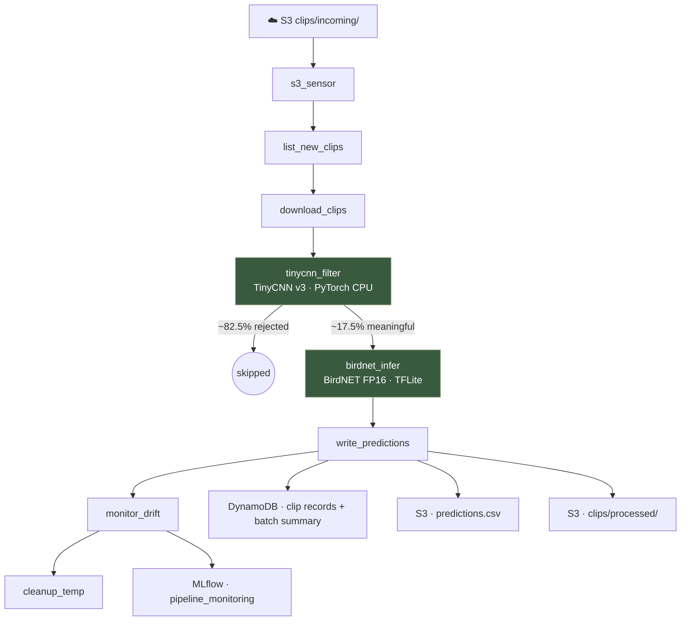
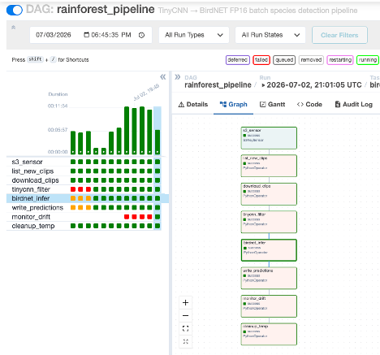
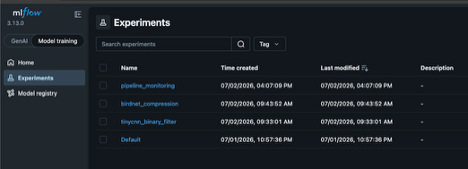
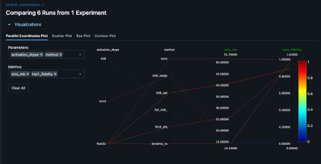

# Rainforest Audio Detection — Two-Stage ML Pipeline

Two-stage bioacoustics pipeline combining a custom TinyCNN binary filter with a compressed BirdNET v2.4 FP16 TFLite classifier — including iterative inference-assisted labeling across 631k unlabeled clips, and three failed INT8 quantization attempts before landing on FP16 PTQ that outperforms the official INT8 QAT reference on both size and fidelity. Deployed on AWS with Airflow orchestration, MLflow experiment tracking, drift monitoring, and CI/CD via GitHub Actions.

**[Results](#results) · [Architecture](#architecture) · [Deployment](#deployment)**

## Overview

This pipeline will also be deployed on edge devices placed in the rainforest field, so there are real constraints: limited compute, battery life, and unreliable internet. That's why I designed the pipeline with a two-stage cascade:

1. **TinyCNN binary filter** — a lightweight CNN (trained on 16,845 labeled clips across 4 iterative labeling rounds) scores each clip as meaningful or background in ~40ms on CPU. Clips below the threshold never reach the classifier.
2. **BirdNET FP16 TFLite** — a compressed version of the BirdNET v2.4 model (FP16 post-training quantization, 26.0 MB vs 51.7 MB FP32) runs species inference only on clips that passed Stage 1.

The pipeline runs as an 8-task Airflow DAG on AWS EC2, reading clips from S3, writing predictions to DynamoDB, and logging drift metrics to MLflow after every batch. The Docker image is built with PyTorch (TinyCNN inference) and TensorFlow Lite (BirdNET inference), pushed to ECR via GitHub Actions CD, and pulled to EC2 on deploy. A CI workflow runs on every push — ruff lint and DAG syntax validation before any image build.

## Results

### Stage 1 — TinyCNN binary filter

| Version | Training clips (not_meaningful) | F1 | Precision | Recall |
|---|---|---|---|---|
| v1 | 2,997 | 0.982 | 0.969 | 0.995 |
| v2 | 6,497 | 0.989 | 0.983 | 0.996 |
| **v3 (production)** | **11,213** | **0.990** | **0.980** | **1.000** |
| v4 | 16,845 | 0.983 | 0.967 | 1.000 |

v3 is the production model — highest F1 with perfect recall on the not_meaningful class. v4 adds more labels but shows slight F1 regression, confirming v3 as the convergence point.

### Stage 2 — BirdNET v2.4 compression

| Variant | Size | Top-1 Fidelity vs FP32 |
|---|---|---|
| FP32 baseline | 51.7 MB | — |
| Dynamic range INT8 | 14.2 MB | Failed |
| Full INT8 calibrated | 14.1 MB | 0.00% |
| INT8 × INT16 activations | 14.4 MB | Failed |
| **FP16 PTQ (ours)** | **26.0 MB** | **95.33%** |
| INT8 QAT (Zenodo reference) | 41.0 MB | 89.64% |

FP16 outperforms the official INT8 QAT reference (95.33% vs 89.64%) at 49.8% of the original size. Three INT8 approaches failed due to quantization errors in BirdNET's mel filterbank layers — FP16 preserves the floating-point precision those layers require.

### DAG pipeline — 1,000-clip demo batch

| Metric | Value |
|---|---|
| Clips filtered by TinyCNN | 825 / 1,000 (82.5%) |
| Clips reaching BirdNET | 175 |
| Mean BirdNET top-1 confidence | 0.4605 |
| Drift flag | 0 — meaningful rate matches 17.5% baseline |

## Architecture



## Stage 1 — TinyCNN Binary Filter

### Model architecture

TinyCNN takes a mel spectrogram (128 mel bands, 48 kHz, 3-second window) as input and outputs a single probability: meaningful or not. Three conv layers, batch norm, adaptive average pooling, two fully connected layers — intentionally minimal, running in ~40 ms per clip on CPU.

### The hardest part: labels

The model architecture was never the problem. Getting reliable labels for 631k AudioMoth clips across 6 recorders was.

**Precision collapse.** Initial training used BirdNET confidence ≥ 0.3 as the meaningful oracle and YAMNet for human activity. On balanced test data the model reached 97% recall and ~80% precision — seemingly strong. On the full 631k-clip dataset, precision collapsed to 17% while recall held at 97%.

**Listening study: the labels were wrong.** A structured listening study on 270 sampled "false positives" — stratified across 6 recorders and 3 model-confidence bins — found that 93% were correct detections: real bird or animal sound that BirdNET had missed at confidence ≥ 0.3. The model was right. Estimated true precision after correcting for hidden true positives: ~94%.

Full diagnosis: [`docs/DIAGNOSIS_LABELS.md`](docs/DIAGNOSIS_LABELS.md)

### Rebuilding meaningful labels (two sources)

- **Simulation events** — 63 staged field events (gunshots, chainsaws, vehicles, human presence) at known times near specific recorders gave 10,871 ground-truth clips independent of any model.
- **BirdNET named species at any confidence** — a 100-clip audit found bird sound in 100/100 clips regardless of confidence. Low confidence means faint or distant bird, not absence of one. This added 108,069 clips and replaced the old ≥ 0.3 threshold.

### Rebuilding not_meaningful labels

After carving out the meaningful clips, labeling the not_meaningful class from the remaining 500k+ unknown pool was the hardest problem. Both obvious signals failed: BirdNET confidence was a constant zero across the unknown pool (all named-species clips were already carved out), and model scores were no better — a spot-check audit of 80 low-scoring unknowns found 42 meaningful and 38 background with no purity gradient at any threshold. Here are the strategies I used:

**RMS energy scan** — finds sustained quiet stretches (below the recording's own 5th-percentile threshold for 2+ minutes). Human spot-check confirmed 94 background clips. Known limitation: only finds quiet background, misses loud-but-biologically-empty windows like heavy rain.

**Spectral flatness scan** — computes Wiener entropy per window. Flat spectrum (close to 1.0) means broadband noise like rain, wind, or insect chorus. Found background candidates at times of day the RMS scan missed. Added 2,903 clips.

**Iterative model-assisted labeling** — starting from acoustically-confirmed clips, each TinyCNN version was used to surface additional candidates from the unknown pool, audited per-recorder before labeling:

| Round | not_meaningful clips | Key decision |
|---|---|---|
| Acoustic scan | 2,997 | RMS + spectral flatness, human verified |
| v1 → model inference | 6,497 | Per-recorder thresholds: AM3 at 0.99, others at 0.95 |
| v2 → model inference | 11,213 | AM1/AM2 failed 85% precision gate — threshold raised to 0.99 |
| v3 → model inference | 16,845 | All 6 recorders pass at uniform 0.95 — no split needed |

Full labeling strategy: [`docs/LABELING_STRATEGY.md`](docs/LABELING_STRATEGY.md)

v3 trained on 11,213 clips is the production model (F1 = 0.990, recall = 1.000). v4 confirms convergence — 5,632 more clips do not improve F1.

Full training documentation: [`docs/MODEL_TRAINING.md`](docs/MODEL_TRAINING.md)

## Stage 2 — BirdNET Compression

Full documentation: [`docs/BIRDNET_COMPRESSION.md`](docs/BIRDNET_COMPRESSION.md)

### The goal

BirdNET v2.4 is a 51.7 MB FP32 TFLite model. For edge deployment on Raspberry Pi 4 and cost-efficient cloud inference, the target was a smaller model that preserved species identification fidelity against the FP32 reference.

### What I tried first: INT8 PTQ

The natural first approach was post-training quantization to INT8 — weights and activations both quantized, 72%+ size reduction. Three INT8 variants were attempted:

- **Dynamic range INT8** (14.2 MB) — wrong predictions on sanity check
- **Full INT8 calibrated** (14.1 MB, 100 calibration clips) — 0/500 top-1 agreement on spot check. Two models cannot disagree on 100% of 500 clips by chance.
- **INT8 weights + INT16 activations** (14.4 MB) — still wrong

### Why INT8 fails for this model

Tensor inspection of the official Zenodo INT8 model revealed `FakeQuantWithMinMaxVars` and `quant_`-prefixed ops — artifacts of **quantization-aware training (QAT)**, not PTQ. The model was retrained with fake quantization nodes during training, making it numerically robust to INT8 precision. Standard PTQ applies quantization to a model never trained with this constraint.

The root cause: INT8 weight quantization rounds small mel filterbank values to zero. FP16 preserves those values (~3.3 decimal digits vs INT8's ~2.1). INT16 activations don't help because the damage happens at the weight level.

### What worked: FP16 PTQ

Weights stored as float16, runtime computation in float32. No calibration needed. ~10 seconds to convert.

FP16 vs official INT8 QAT — head to head:

| Model | Size | Top-1 fidelity vs FP32 |
|---|---|---|
| FP32 baseline | 51.7 MB | — |
| Official INT8 QAT (Zenodo) | 41.0 MB | 89.64% |
| **FP16 PTQ (ours)** | **26.0 MB** | **95.33%** |

FP16 is 15 MB smaller than the official INT8 and 5.7 percentage points closer to FP32. The 4.67% disagreement comes from borderline clips at very low confidence — at confidence ≥ 0.35, agreement rises to 98.33%.

## Deployment

Full documentation: [`docs/DEPLOYMENT.md`](docs/DEPLOYMENT.md)

The pipeline runs as an 8-task Airflow DAG on an AWS EC2 t3.large instance, triggered by an S3KeySensor when new clips arrive in `clips/incoming/`.



### AWS infrastructure

- **S3** — clip ingestion (`clips/incoming/`) and results (`clips/results/`)
- **DynamoDB** — per-clip predictions and per-run batch summary (total clips, meaningful rate, duration)
- **EC2 t3.large** — Airflow + MLflow running as Docker services via Docker Compose
- **ECR** — Docker image registry for the Airflow container
- **IAM instance profile** — EC2 inherits AWS credentials automatically, no hardcoded keys anywhere

### Docker services

Four services run on EC2 via Docker Compose:

- **`airflow-webserver`** — Airflow UI on port 8080
- **`airflow-scheduler`** — DAG task execution
- **`postgres`** — Airflow metadata database
- **`mlflow`** — MLflow tracking server on port 5000, SQLite backend persisted in a named Docker volume

### CI/CD

Two GitHub Actions workflows run on every push to `main`:

- **CI** — ruff lint on `dags/` and `src/`, DAG syntax validation via `ast.parse`. Runs in ~15 seconds.
- **CD** — builds the Docker image and pushes to ECR with both `:latest` and `:<git-sha>` tags. Runs in ~4–5 minutes.

EC2 pulls the new image manually when ready — no auto-deploy. DAG file changes are picked up automatically by the Airflow scheduler without a container restart.

### MLflow

MLflow 3.13.0 runs as a separate Docker service on the same EC2 instance, with a SQLite backend persisted in a named Docker volume. Accessed via SSH tunnel (`-L 5001:localhost:5000`) — port 5000 is not publicly exposed. Three experiments are tracked:

- **`tinycnn_binary_filter`** — training runs across all 4 model versions
- **`birdnet_compression`** — all PTQ variants with size and fidelity metrics
- **`pipeline_monitoring`** — per-DAG-run drift metrics logged by the `monitor_drift` task



The `birdnet_compression` experiment records every quantization attempt — dynamic range INT8, calibrated INT8, 16×8, FP16 — alongside the official INT8 QAT reference, making the comparison reproducible.



## Design decisions & tradeoffs

### Two-stage cascade over a single model
BirdNET is expensive; ~82% of field audio is background. Running BirdNET on everything wastes compute. A cheap TinyCNN filter up front means the expensive model only runs on clips likely to contain something to identify.

### FP16 PTQ over INT8
INT8 is smaller and faster, but the official INT8 model is QAT-trained and not reproducible via PTQ. FP16 PTQ is 15 MB smaller than the official INT8 and 5.7 points higher fidelity. Fidelity was prioritized over the 3 ms latency saving.

### LocalExecutor over Celery
The workload is batch-shaped and single-instance. Celery adds Redis, workers, and operational complexity without a benefit at this scale.

### Models on EC2 disk over S3-backed model registry
Single-instance batch workload. On-disk models mean no S3 round-trip on container restart, no GET costs, no risk of S3-vs-disk drift. A multi-instance or auto-scaling deployment would need S3-backed versioned models.

### Manual deploy over auto-deploy from CD
Auto-deploy from GitHub Actions to EC2 requires storing EC2 credentials in GitHub Secrets and adds operational complexity without demonstrating additional ML engineering skill. Manual pull protects against accidental deploys to a running system.

### Single Docker image with both PyTorch and TensorFlow
Heavy image (~1.5 GB) but simpler than per-stage containers. Splitting into two containers would add orchestration complexity for a two-stage pipeline without a payoff.

### SQLite for MLflow over RDS
Single-instance, low write volume (one batch run at a time), no concurrent writers. RDS adds $15–30/month and operational overhead for a workload that generates a handful of MLflow runs per day. Named Docker volume survives container restarts.

## Reproducing the project

### Local development

```bash
git clone https://github.com/QianFu520/rainforest-audio-detection.git
cd rainforest-audio-detection
pip install -r requirements.txt
```

### AWS deployment

Prerequisites: AWS account with S3, DynamoDB, EC2, ECR, and IAM configured. Full setup steps in [`docs/DEPLOYMENT.md`](docs/DEPLOYMENT.md).

```bash
# On EC2
git clone https://github.com/QianFu520/rainforest-audio-detection.git /opt/rainforest-audio-detection
cd /opt/rainforest-audio-detection

# Pull models
aws s3 cp s3://<bucket>/models/tinycnn_v3.pth ./outputs/models/
aws s3 cp s3://<bucket>/models/birdnet_v2.4_fp16.tflite ./outputs/models/

# Build and start the stack
docker compose build
docker compose --profile init up airflow-init
docker compose up -d
```

Airflow UI available at `http://<EC2_PUBLIC_IP>:8080`. MLflow UI via SSH tunnel: `ssh -L 5001:localhost:5000 ubuntu@<EC2_PUBLIC_IP>` then `http://localhost:5001`.

### Trigger a batch run

Upload `.wav` clips to `s3://<bucket>/clips/incoming/`. The `s3_sensor` task polls and the DAG runs automatically. Predictions land in DynamoDB and `s3://<bucket>/clips/results/{dag_run_id}/predictions.csv`.

## Known limitations

**Raspberry Pi 4 never benchmarked.** Edge deployment on Raspberry Pi 4 informed the model size target and TFLite runtime choice, but the pipeline was never actually run on Pi hardware. Latency numbers (40–70 ms per clip) are from a MacBook Pro M4 as a development reference only.

**Labels cover ~22% of the dataset.** Of 631k clips, ~118k meaningful and ~17k not_meaningful carry confident labels. The remaining ~78% are unknown — excluded from training rather than guessed. The model generalizes well to the full dataset, but edge cases in the unknown pool are unverified.

**Stage 2 fidelity, not accuracy.** BirdNET compression is evaluated against the FP32 model's own predictions, not human-verified species labels. No ground-truth species labels exist for this dataset. The 95.33% metric measures compression fidelity — how faithfully FP16 reproduces FP32 — not whether either model is correct.

**Inference logic lives in the DAG file.** `tinycnn_filter` and `birdnet_infer` are ~300 lines inside `rainforest_pipeline.py` with no unit tests. Production pattern would extract them into a `pipeline/` module with pytest coverage.

**S3 move is not idempotent.** Processed clips move from `clips/incoming/` to `clips/processed/` via copy + delete per file. If the loop fails mid-way, the bucket ends up in a mixed state. Production fix: two-pass (copy all → verify → delete all).

**Manual CD.** GitHub Actions builds and pushes the Docker image to ECR automatically, but EC2 pulls manually. No auto-deploy to a running system.

**Single-instance deployment.** LocalExecutor on one EC2 t3.large. No horizontal scaling, no auto-recovery. A higher-volume production system would need CeleryExecutor + worker pool, or migration to ECS/Kubernetes.

**MLflow on SQLite.** One writer at a time. Concurrent DAG runs would cause lock contention. Not an issue for the current sequential batch workload, but rules out parallelized pipeline runs without migrating to PostgreSQL or a managed MLflow backend.

**EC2 public IP is not static.** Stopping and restarting the instance changes the public IP, requiring updates to `MLFLOW_SERVER_ALLOWED_HOSTS` and the deployment docs. An Elastic IP would fix this permanently.

## Tech Stack

- **Language:** Python 3.11
- **ML frameworks:** PyTorch 2.2.2 (TinyCNN), TensorFlow Lite 2.20 (BirdNET)
- **Audio processing:** librosa, soundfile
- **Orchestration:** Apache Airflow 2.9.3 (LocalExecutor)
- **Experiment tracking:** MLflow 3.13.0
- **Containerization:** Docker + Docker Compose
- **CI/CD:** GitHub Actions
- **Cloud:** AWS (S3, EC2, DynamoDB, ECR, IAM)
- **Metadata DB:** PostgreSQL 15 (Airflow), SQLite (MLflow)

Full dependency versions in [`requirements.txt`](requirements.txt).
